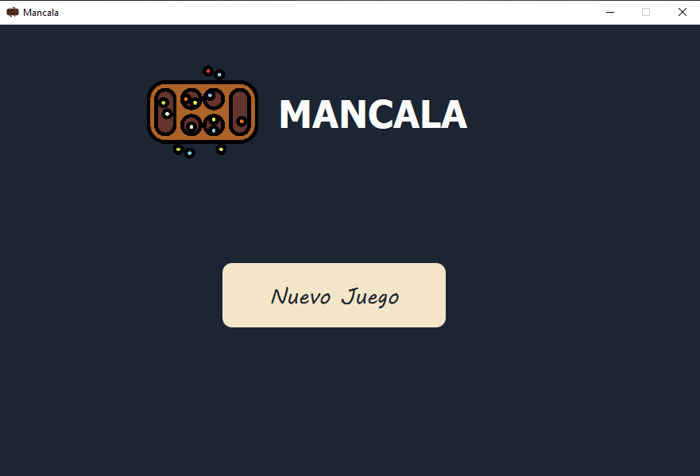
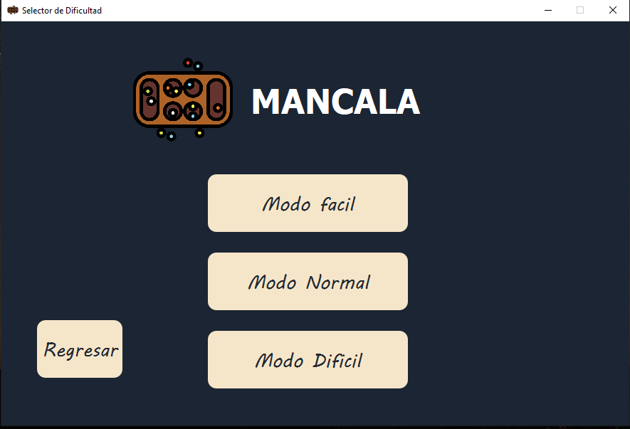
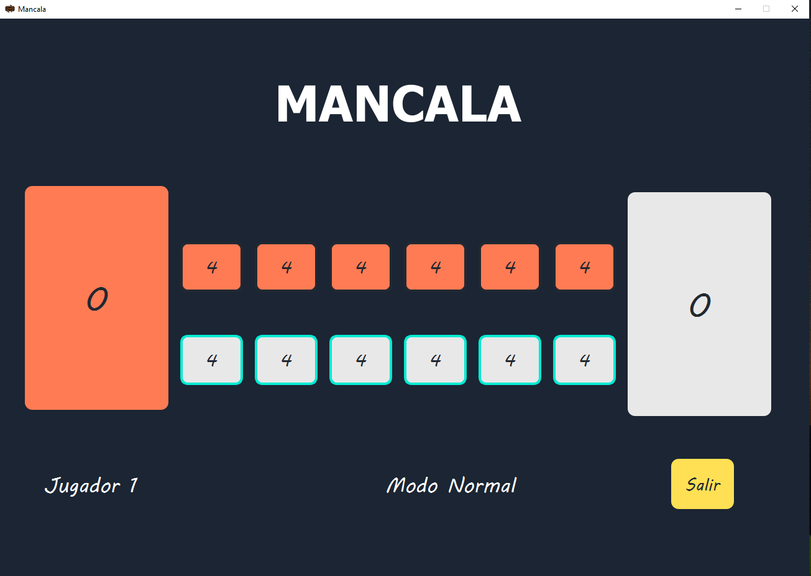

# JUEGO DE MANCALA (Algoritmo Minimax)

Este es un programa de Python creando el juego de Mancala, un jugador contra la máquina, usando está el algoritmo de búsqueda adversaria Minimax con podado Alpha-beta, evalúa los movimientos posibles del jugador y los del oponente, y luego le asigna un valor a cada movimiento según la puntuación esperada.

## Detalles de la implementacion
Para la creacion del programa utilizamos una libreria de Python llamada [pyqt5](https://pypi.org/project/PyQt5/#:~:text=PyQt5%20is%20a%20comprehensive%20set,including%20iOS%20and%20Android.) para la creacion del GUI, aparte de otra librerias basicas de python.

# Partes del programa

### Página de inicio
Página inicial del juego, aqui puedes inciar el juego de Mancala

### Página de selector de dificultad
Página de selector de difultad, donde puede elegir hasta 3 dificultades (facil, normal, dificil), donde mas avanzada sea la dificultad mayor sera la profundidad que utilize el algoritmo minimax para optimizar sus jugadas.

### Página del juego
Pagina del juego del mancala, aqui es donde se juega el juego contra la maquina, siguiendo todas las reglas del juego y finalizar hasta que haya un ganador

## Como correr nuestro codigo
Lo unico que tienes que hacer es dirigirte al archivo **start_page.py** y ejecuta el codigo y asi podras jugar!

# DISFRUTA DEL JUEGO DE MANCALA!!

